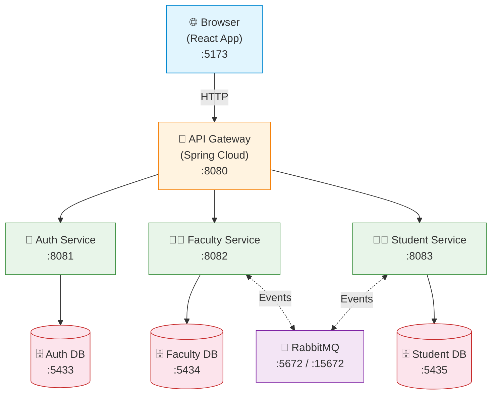

# 🤝 ColabBridge

**ColabBridge** is a microservices-based collaborative platform built with **Spring Boot** and **React**, connecting faculty and students for academic project collaborations. It includes secure JWT authentication, role-based access, project management, report uploads, and event-driven notifications via RabbitMQ.

---

## 🚀 Quick Start (One Command)

### Prerequisites

| Tool | Version | Download |
|------|---------|----------|
| **Docker Desktop** | v20.10+ | [docker.com/products/docker-desktop](https://www.docker.com/products/docker-desktop) |
| **Node.js** | v18+ | [nodejs.org](https://nodejs.org) |
| **Git** | any | [git-scm.com](https://git-scm.com) |

### Run the project

```bash
git clone https://github.com/mrvivekthumar/ColabBridge.git
cd ColabBridge
```

**Windows — double-click or run:**

```batch
start.bat
```

That's it. The script will:

1. Verify Docker, Node.js, and npm are installed
2. Create a persistent data folder at `C:\Users\<you>\Documents\ColabBridge\`
3. Build and start all backend services via Docker Compose
4. Wait for databases and services to become healthy
5. Install frontend dependencies (first run only)
6. Launch the frontend dev server

**Then open:** [http://localhost:5173](http://localhost:5173)

---

## 📂 Where is my data stored?

All database data and logs are persisted on your **physical machine** (not inside Docker volumes), so nothing is lost when containers are removed.

```
C:\Users\<you>\Documents\ColabBridge\
├── databases\
│   ├── auth-db\           ← Auth PostgreSQL data
│   ├── faculty-db\        ← Faculty PostgreSQL data
│   └── student-db\        ← Student PostgreSQL data
├── logs\
│   └── combined.log       ← Central log file (all services write here)
└── rabbitmq\              ← RabbitMQ persistent data
```

**View central logs:**

```powershell
Get-Content "$HOME\Documents\ColabBridge\logs\combined.log" -Tail 50 -Wait
```

---

## 🎯 Features

- 🔐 **Auth Service** — User authentication and role-based authorization using Spring Security + JWT
- 👨‍🏫 **Faculty Service** — Faculty can post project ideas, review applications, and manage teams
- 👨‍🎓 **Student Service** — Students browse, apply for, and submit reports for projects
- 🔀 **API Gateway** — Single entry point routing requests to microservices with JWT validation
- 🐰 **RabbitMQ** — Event-driven communication between services
- 🌐 **React Frontend** — Modern UI built with Vite, Tailwind CSS, and Shadcn/UI

---

## 🧩 Architecture



---

## 🛠️ Tech Stack

### Backend

- Java 17 / Spring Boot 3.x / Spring Cloud Gateway
- Spring Security + JWT / Spring Data JPA
- PostgreSQL / RabbitMQ
- Docker & Docker Compose

### Frontend

- React 18 / Vite / Tailwind CSS / Shadcn/UI
- Axios / React Router / Framer Motion

---

## 🌐 Service Endpoints

| Service | Port | URL |
|---------|------|-----|
| Frontend | 5173 | [http://localhost:5173](http://localhost:5173) |
| API Gateway | 8080 | [http://localhost:8080](http://localhost:8080) |
| Auth Service | 8081 | [http://localhost:8081/auth/actuator/health](http://localhost:8081/auth/actuator/health) |
| Faculty Service | 8082 | [http://localhost:8082/faculty/actuator/health](http://localhost:8082/faculty/actuator/health) |
| Student Service | 8083 | [http://localhost:8083/student/actuator/health](http://localhost:8083/student/actuator/health) |
| RabbitMQ UI | 15672 | [http://localhost:15672](http://localhost:15672) (guest/guest) |

### Database Ports

| Database | Port | User | Password |
|----------|------|------|----------|
| Auth DB | 5433 | auth_user | auth_password |
| Faculty DB | 5434 | faculty_user | faculty_password |
| Student DB | 5435 | student_user | student_password |

---

## 📦 Project Structure

```
ColabBridge/
├── start.bat                  # One-click startup (Windows)
├── backend/
│   ├── Api-Gateway/           # Spring Cloud Gateway
│   ├── Authentication-Service/ # Auth & JWT
│   ├── FacultyService/        # Faculty management
│   ├── StudentService/        # Student management
│   ├── docker-compose.yml     # Docker orchestration
│   ├── .env                   # Backend environment variables
│   └── k8s/                   # Kubernetes manifests
├── frontend/
│   ├── src/
│   │   ├── api/               # API service layer
│   │   ├── components/        # React components
│   │   ├── pages/             # Page components
│   │   └── contexts/          # React contexts
│   ├── package.json
│   └── .env                   # Frontend config
└── README.md
```

---

## 🐛 Troubleshooting

### Database containers show "Error" on first run

This is normal — first-time PostgreSQL initialization on a local bind mount takes longer than Docker's default health check timeout.
Run `start.bat` again or `cd backend && docker compose up -d`; the DBs will already be initialized and start instantly.

### Port conflicts

```powershell
# Find what's using a port
netstat -ano | findstr :8080
# Kill it
taskkill /PID <PID> /F
```

### Reset everything

```powershell
cd backend
docker compose down
Remove-Item -Recurse "$HOME\Documents\ColabBridge"
docker compose up -d --build
```

### Frontend can't connect to backend

1. Ensure API Gateway is running: `curl http://localhost:8080/actuator/health`
2. Check `frontend\.env` has `VITE_API_BASE_URL=http://localhost:8080`
3. Restart frontend: `cd frontend && npm run dev`

---
---

## 📧 Contact

**Developer:** Vivek Thumar
**Email:** [mrvivekthumar@gmail.com](mailto:mrvivekthumar@gmail.com)
**GitHub:** [@mrvivekthumar](https://github.com/mrvivekthumar)
**University:** DDU University, Gujarat

---
---

*Last Updated: March 2026*
